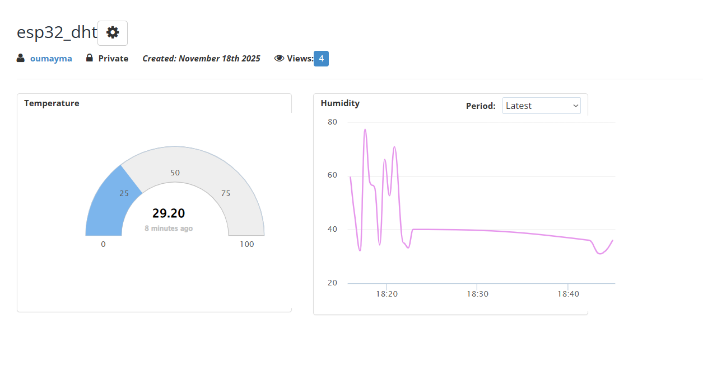

# Simulation d'un Système intelligent de surveillance de Température et d'Humidité  
Projet académique - Simulation complète d'une solution IoT

<b> Description  du Projet  </b> 

Système IoT hybride combinant matériel réel et simulation logicielle pour valider une architecture complète avant déploiement physique 

<b> Composants </b> 

 - ESP32 réel 
 - capteur DHT22 simulé ( données générées par logiciel ) 
 - Dashboard web local fonctionnel
 - Synchronisation avec une plateforme cloud ( Beebotte ) 
  
<b>Technologies  </b> 
- Microcontroleur : ESP32
- Capteur DHT22 ( simulé )
- Communication : WIFI HTTP 
- Backend : C++ (Arduino)
- Frontend : HTML / CSS / JS
- cloud : Beebotte API

  <b>  Fonctionnement </b>

  1/ Géneration de données
  
  2/ Affichage sur le dashboard web embarqué
  
  3/ Envoi automatique a Beebotte  

 <b> Captures d'écran </b>
 
  Dashboard Local
  

  Données Cloud
  
  
